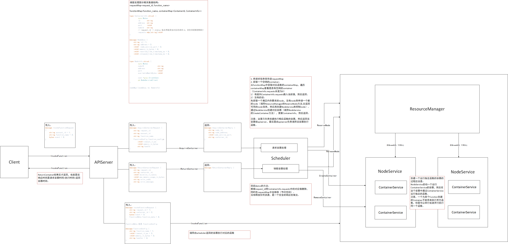

# 实现一个 Serverless 计算服务调度系统
##架构图

## 总结
go实现，37/181，响应时间不太行。  
中间被一个没发现的bug浪费了很长时间，导致很多想法没有尝试，  
同时自己go还不是很熟，整个优化过程都是一点点边学边改边验证。  
虽然可惜，不过还是硬实力不足，以后再加油。

## 信息记录
提交运行的镜像策略是Always，所以不用会运行其本地的镜像。  
目前评测程序开始之前会预热10个节点，最多是申请20个节点，申请节点成功情况下延迟都很低。提交的日志中打印的scheduler直接申请了10个节点，应该是并发调用请求导致的。  
函数执行完后，会自己通知apiserver，再由apiserver调用scheduler的returncontainer。  
ReturnContainer也要计算耗时  
容器是有内存限制的，是由调度器createcontianer时指定的。容器启动时间平均3、4秒  
cpu是配额的，申请1G内存的容器只能用0.67的cpu  
docker deamon 会对容器的cpu，内存进行管理，如果系统的资源不满足指定的要求就会等待。  
目前函数调用规律：每次取一个函数连续调用多次，也就是说某个时间段内都会是同一个函数的调用，某个函数可能只在一段时间内调用。apiserver的函数调用是非阻塞的。（正式赛环境）
ReserveNode 获取的memory 和 getNoteStatus的不一样？  
目前总共73300次调用  
apiserver请求错误超过0.001加10分  
200 - 800ms 进行一轮调用  
记录2500次调用日志文件大小162MB，不打印节点日志的话只有1.82MB  
due to rpc error: code = 4 desc = context deadline exceeded客户端提示超时，但是scheduler没有报错，说明是超过了客户端的时间限制导致的。瓶颈是在调用s.router.AcquireContainer(ctx, req)时阻塞导致的。（待优化）  

## go语言相关
除了从主函数退出或者直接终止程序之外，没有其它的编程方法能够让一个goroutine来打断另一个的执行  
go语言在获取锁的时候就会刷新缓存，保证取到最新值，从而保证了可见性  
concurrent-map只对外层的值保证线程安全，如果值是一个对象的话，对值里面进行操作是不保证线程安全的。  
锁只对加了锁的地方有影响  
原子操作也会对性能有影响  
一个结构体，对整个结构加锁，对结构体内的元素的锁是没有影响的，同样如果是对结构体内的元素加锁，对整个结构体的锁也是没有影响的，也就是说只有相同的锁才会互相影响。  
加上互斥锁就是表示从这里开始对该锁对应的结构进行操作时没有其他线程可以同时操作该结构直至释放锁，同时保证拿到的这个结构的值是最新的。  
读写锁可以同时读，可能导致的问题在于多线程同时读了一个值都发现这个值满足条件，但是可能之后要对这个值进行改变，改变之后的值可能就不符合要求了。  
为什么传结构体的指针，因为比直接传传结构体速度快  
ConcurrentMap长度总是32，要用count  
注意go语言的map是不能进行并发读写操作的会直接报错。  
{"log":"fatal error: concurrent map writes\r\n","stream":"stdout","time":"2020-07-26T10:43:26.340842112Z"}  

## 问题分析
官方：  
容器和机器还存在多对一的关系，一个机器按内存划分，可以创建多个容器。比赛使用的Node规格是ecs.c6.large，2C4G（2核4GB内存）ECS虚拟机，容器的最大内存由函数指定（函数内存），CPU和内存按比例分配。  
在上述的调度模型下，主要的问题可以分为两类：  
Scaling问题：如何保持合适的容器数来匹配函数的负载变化  
初次启动容器的冷启动会增加响应时间，容器闲置多长时间才释放？如何预测函数的负载变化，主动进行调度？  
当某个瞬间多个请求到来时，没有Idle容器，是否需要为每个请求创建容器？  
Placement问题：如何把容器放置到合适的Node上来减少资源浪费  
Scheduler可能创建了多个Node，当请求到来时选择哪个Node创建容器？这时候一般要考虑尽量将容器紧密的放置在Node上，提高容器密度，减少Node的使用个数；同时又要考虑不同容器的影响，多个CPU instensive的负载会互相影响。
当有多个容器Idle时，选择哪个容器来执行函数？  
如何定义容器Busy？最保守的做法是一个容器只处理一个并发请求，但是对于有些类型的函数，处理多个请求对执行时间影响不大。  
一个Node可以创建多少容器？因为容器是根据函数内存指定了最大内存限制，保守的做法是按照最大内存决定一个Node的容器个数，但是对于有些类型的函数，同一个Node创建更多的容器是可行的。  

## 镜像
registry.cn-hangzhou.aliyuncs.com/odyimage/mini-faas:1.0  
demo  

registry.cn-hangzhou.aliyuncs.com/odyimage/mini-faas:1.1  
demo加日志  

registry.cn-hangzhou.aliyuncs.com/odyimage/mini-faas:1.2  
限制节点数达到最大不再申请，一个容器可以允许多个函数，以过往函数执行时的最大内存的平均值作为函数所需内存大小  
出错：  
code = 4， code = 8， code = 13  
问题：  
一下申请了20个节点，却只用了8个节点  
容器也是有资源限制的  

registry.cn-hangzhou.aliyuncs.com/odyimage/mini-faas:1.3  
修复：应该是先从现有该函数的容器判断，容器有资源则还可以使用其继续执行，没有再判断当前所有申请的节点中是否有资源创建容器，没有则申请新节点创建容器。  
日志：增加打印间隔限制，增加当前计算  

registry.cn-hangzhou.aliyuncs.com/odyimage/mini-faas:1.4  
操作nodeMap 和 FunctionStatus 时使用互斥锁，防止获取时是可用的，但是由于并发导致最后实际上变负数。  
增加预留容器个数，预留节点个数，添加释放容器、释放节点机制，通过使节点和容器尽可能紧密排布，来更好的释放容器、释放节点。  
达到节点或容器上限时等待容器释放。  
问题：为什么本地测试时客户端全部request id都返回了，但是scheduler显示返回的request id却少了。好像有时是对的上的，有时候又少了，线程不安全？  

registry.cn-hangzhou.aliyuncs.com/odyimage/mini-faas:1.5  
对锁进行优化  
容器和节点优先取保留节点上的  
nodeMap不能用读写锁  
通过channel通知  
问题：  
MaxContainerNum，ReserveContainerNum 含义明确  
nodeMap和containerMap中的containers和requests有没有必要用cmap.ConcurrentMap  
todo:  
根据频率决定预留容器数  
定时获取node状态，修订容器空余内存  

registry.cn-hangzhou.aliyuncs.com/odyimage/mini-faas:1.6  
尽量去锁  

registry.cn-hangzhou.aliyuncs.com/odyimage/mini-faas:1.6-simple  
取消删除  

registry.cn-hangzhou.aliyuncs.com/odyimage/mini-faas:1.7  
各种调试  

registry.cn-hangzhou.aliyuncs.com/odyimage/mini-faas:1.8  

registry.cn-hangzhou.aliyuncs.com/odyimage/mini-faas:1.9  
本地不加锁快10s  

registry.cn-hangzhou.aliyuncs.com/odyimage/mini-faas:2.3  
最终   

